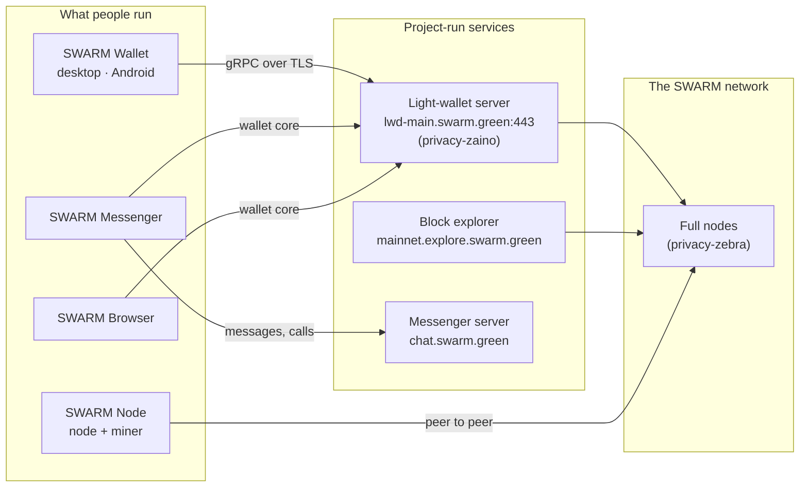

# SWARM (SWM)

[](https://swarm.green/network)
[](https://mainnet.explore.swarm.green)
[](https://swarm.green/ecosystem/)
[](LICENSE)

**SWARM is private money.** A proof-of-work coin whose shielded payments keep the sender, the receiver and the amount encrypted, with a desktop and mobile wallet, a messenger that pays inside the conversation, and a browser with the wallet built in.

| | |
| --- | --- |
| Website | [swarm.green](https://swarm.green/) |
| Downloads and checksums | [swarm.green/ecosystem](https://swarm.green/ecosystem/) |
| Mainnet explorer | [mainnet.explore.swarm.green](https://mainnet.explore.swarm.green) |
| Testnet explorer | [testnet.explore.swarm.green](https://testnet.explore.swarm.green/) |
| Status feed | [lwd-main.swarm.green/status.json](https://lwd-main.swarm.green/status.json) |
| X | [@swarm_coin](https://x.com/swarm_coin) |
| Mail | swarmofficial@atomicmail.io |

> **Status.** SWARM mainnet has been live since **2 October 2026, 15:42 UTC**. The genesis block holds no spendable coins; every SWM that exists has been mined. The chain started closed: until **31 October 2026, 15:42 UTC** only the project's own machines mine, early access follows for 24 hours, and **public mining opens on 1 November 2026, 15:42 UTC**. In those 29 days about 33,408 blocks and about 208,800 SWM are produced, about 0.99 % of the maximum supply, split 80 % to the project's mining wallet and 20 % to the three funds like every other block.

---

## Contents

- [What is SWARM?](#what-is-swarm)
- [The numbers](#the-numbers)
- [Where the coins go](#where-the-coins-go)
- [The software](#the-software)
- [How it fits together](#how-it-fits-together)
- [Networks](#networks)
- [Getting started](#getting-started)
- [Building from source](#building-from-source)
- [Security warnings](#security-warnings)
- [Releases and verification](#releases-and-verification)
- [Lineage and licences](#lineage-and-licences)
- [Contributing](#contributing)

## What is SWARM?

Most digital money is surveillance money: every transfer is a public record of who paid whom, how much and when. SWARM takes the opposite position. Its shielded transactions use zero-knowledge proofs so that the network can verify a payment without learning anything about it. A transparent mode exists for the cases where visibility is wanted, for example exchanges and audits, and the wallet shows at a glance which kind of address you are dealing with.

SWARM is built on the Zcash protocol stack, the most reviewed shielded-payment system in existence. The consensus rules and the cryptography are those of the upstream software, unmodified. What SWARM adds is its own network: genesis, network identifiers, address prefixes, a fixed emission schedule with a fixed allocation, and the products around it. Technical detail: [doc/protocol.md](doc/protocol.md).

SWARM is experimental software. Read the [security warnings](#security-warnings) before you put value on it.

## The numbers

| Parameter | Value |
| --- | --- |
| Ticker | SWM |
| Proof of work | Equihash 200,9 |
| Target block time | 75 seconds |
| Block reward at launch | 6.25 SWM |
| Halving interval | 1,680,000 blocks, about four years |
| Maximum supply | 20,999,987.3152 SWM |
| Coins in the genesis block | 0 |
| Coinbase maturity | 100 blocks |
| Allocation of every block reward | 80 % miner, 8 % Core Development, 4 % Grants & Ecosystem, 8 % Community & Development Reserve |
| Network magic | `SWMN` |
| Mainnet genesis hash | `01b76d8a0f18c502b23ab6605e26296d189aa5770fc4a34155e5c7b250a0eff2` |
| Genesis header time | 2026-10-02 15:41:37 UTC |
| Shielded address prefix (mainnet) | `swm1…` (unified address, the wallet's default) |
| Transparent address prefixes (mainnet) | `s1…` (pay-to-public-key-hash), `s3…` (pay-to-script-hash) |
| Shielded address prefix (testnet) | `swarm1…` |

The site's [network page](https://swarm.green/network) renders the same values from the published launch manifest. The full emission table is in [doc/economics.md](doc/economics.md).

## Where the coins go

In every block with a reward, for the whole emission schedule:

| Share | Recipient | Destination |
| --- | --- | --- |
| 80 % | the miner who found the block, plus all transaction fees | the miner's own payout address |
| 8 % | Core Development | predefined 2-of-3 multisig script address (`s3fLmEHc1xqs8KAe7QS7oupkhuGDjidV4eq`) |
| 4 % | Grants & Ecosystem | predefined 2-of-3 multisig script address (`s3RiGvK5JzS8eh6ywN3K22f2LzDAhicgFuq`) |
| 8 % | Community & Development Reserve | predefined 2-of-3 multisig script address (`s3g3pzQVhvVX17bzrrEN3vmcXZWSpj7KFVp`) |

The 20 % is emitted block by block as part of each block reward. It is **not a premine**: nothing exists before it is mined, and every halving reduces all four amounts proportionally until block rewards reach zero. The destinations are fixed in the genesis rules and can only be changed through a formal protocol upgrade. Stated plainly: unlike Zcash's Founders' Reward, which ended after four years, SWARM's allocation does not end; over the life of the chain about 4.2 million SWM go to the three project-side destinations. Each fund address is controlled by three key shares generated offline at the launch key ceremony.

## The software

Every component is open source. Installers are served from the project's own server and listed with their SHA-256 checksums on [swarm.green/ecosystem](https://swarm.green/ecosystem/); the source lives in the repositories below.

| Repository | What it is | Based on | Licence |
| --- | --- | --- | --- |
| [privacy-zebra](https://github.com/Swarmcoin/privacy-zebra) | The full node: validates blocks and transactions, serves the network. Consensus rules and cryptography unmodified. | [Zebra](https://github.com/ZcashFoundation/zebra) (Zcash Foundation) | MIT / Apache-2.0 |
| [privacy-zaino](https://github.com/Swarmcoin/privacy-zaino) | The indexer behind the light-wallet servers and the explorer. | [Zaino](https://github.com/zingolabs/zaino) (Zingo Labs) | Apache-2.0 |
| [privacy-zingolib](https://github.com/Swarmcoin/privacy-zingolib) · [privacy-lightwallet-protocol-rust](https://github.com/Swarmcoin/privacy-lightwallet-protocol-rust) | The light-wallet SDK and protocol crate carrying the SWARM network definition (release `swarm-sdk-mainnet-1`), so other wallets can be built against the same chain. | [zingolib](https://github.com/zingolabs/zingolib) | MIT |
| [swarm-node](https://github.com/Swarmcoin/swarm-node) | **SWARM Node**: the desktop node and mining app for Windows, Linux and macOS, with a live map of the swarm. | own code, wraps `zebrad` | MIT |
| [privacy-wallet](https://github.com/Swarmcoin/privacy-wallet) | **SWARM Wallet** for desktop (Windows, Linux, macOS): shielded or transparent payments, 24-word recovery phrase, lock code. | [Zingo PC](https://github.com/zingolabs/zingo-pc) | MIT |
| [swarm-mobile](https://github.com/Swarmcoin/swarm-mobile) | **SWARM Wallet for Android**, and the iOS work. | [zingo-mobile](https://github.com/zingolabs/zingo-mobile) | MIT |
| [swarm-wallet-core](https://github.com/Swarmcoin/swarm-wallet-core) | The typed wallet core (TypeScript over the Rust addon) used by SWARM Messenger and SWARM Browser. | own code over zingolib | MIT |
| [swarm-messenger](https://github.com/Swarmcoin/swarm-messenger) · [swarm-messenger-server](https://github.com/Swarmcoin/swarm-messenger-server) · [swarm-libsignal](https://github.com/Swarmcoin/swarm-libsignal) · [swarm-storage-service](https://github.com/Swarmcoin/swarm-storage-service) · [swarm-calling-service](https://github.com/Swarmcoin/swarm-calling-service) | **SWARM Messenger**: end-to-end encrypted messaging between SWARM wallets with payments inside the chat; sign-in with the 24 words, no phone number. Runs on SWARM's own server, never on Signal's. | Signal Desktop, Signal Server, libsignal, storage-service, calling-service (Signal Messenger, LLC) | AGPL-3.0 |
| [swarm-browser](https://github.com/Swarmcoin/swarm-browser) | **SWARM Browser**: Chromium with Google's services removed and the SWARM wallet inside. | [ungoogled-chromium](https://github.com/ungoogled-software/ungoogled-chromium) | BSD-3-Clause |
| [swarm-explorer](https://github.com/Swarmcoin/swarm-explorer) | The block explorer: every block, every transaction, every allocation, with the network named on every page. | own fork | Apache-2.0 |
| [swarm.green](https://github.com/Swarmcoin/swarm.green) | The website. Static, no build step, no tracking of downloads. | own code | see repository |
| [swarm-releases](https://github.com/Swarmcoin/swarm-releases) | Release notes and SHA-256 checksums for every published build. | — | — |

Current public versions: SWARM Wallet 0.1.0-mainnet.10 (desktop), SWARM Wallet for Android 0.2.0-mainnet.4 (direct APK), SWARM Messenger 0.1.4, SWARM Browser 153.0.8010.52-5 (Windows, pre-release), SWARM Node 0.2.0-mainnet.5 (published again when public mining opens).

## How it fits together



Wallets never hold a copy of the chain: they talk to a light-wallet server that indexes it, and they download and decrypt only what belongs to them. The server learns which encrypted notes a wallet asked for, not the amounts or the counterparties; running your own node and indexer removes even that.

## Networks

Two networks run. The plain hostnames belong to the **testnet**; the mainnet names carry `-main` or `mainnet.`. Testnet coins have no value.

| | Mainnet | Testnet |
| --- | --- | --- |
| Name in software | `SwarmMainnet` | `SwarmTestnet` |
| Light-wallet server | `lwd-main.swarm.green:443` | `lwd.swarm.green:443` |
| Explorer | https://mainnet.explore.swarm.green (also `explore.swarm.green`) | https://testnet.explore.swarm.green/ |
| Status feed | https://lwd-main.swarm.green/status.json | — |
| Shielded address prefix | `swm1…` | `swarm1…` |
| Transparent address prefixes | `s1…`, `s3…` | testnet prefixes |

More in [doc/networks.md](doc/networks.md).

## Getting started

1. **Get a wallet.** Download SWARM Wallet for your platform from [swarm.green/ecosystem/wallet](https://swarm.green/ecosystem/wallet), compare the SHA-256 checksum, install, write down the 24 words. The wallet connects to the mainnet light-wallet server by default and shows `swm1…` addresses.
2. **Receive and send.** Shielded by default; choose a transparent address only when the other side needs one.
3. **Follow the chain.** [mainnet.explore.swarm.green](https://mainnet.explore.swarm.green) shows every block and the allocation of every reward.
4. **Mine.** Public mining opens on 1 November 2026, 15:42 UTC, through the SWARM Node app (CPU mining of Equihash 200,9 from the app itself). The app and a mining guide are published on the site when the closed start ends.
5. **Talk.** SWARM Messenger signs you in with the wallet's 24 words and pays inside the conversation.

Step by step: [doc/getting-started.md](doc/getting-started.md).

## Building from source

Each repository has its own README with the exact toolchain. The short version:

```bash
# Full node (Rust 1.96, see the repository's rust-toolchain)
git clone https://github.com/Swarmcoin/privacy-zebra && cd privacy-zebra
cargo build --release --bin zebrad

# Indexer / light-wallet server
git clone https://github.com/Swarmcoin/privacy-zaino && cd privacy-zaino
cargo build --release

# Desktop wallet (Node 22, Yarn, Rust for the addon)
git clone https://github.com/Swarmcoin/privacy-wallet && cd privacy-wallet
yarn install && yarn build && yarn start

# SWARM Node app (Node 22)
git clone https://github.com/Swarmcoin/swarm-node && cd swarm-node
npm install && npm test && npm start

# Wallet core used by Messenger and Browser
git clone https://github.com/Swarmcoin/swarm-wallet-core && cd swarm-wallet-core
npm ci && npm run typecheck && npm test
```

Details per component, including the messenger and the browser builds: [doc/building.md](doc/building.md).

## Security warnings

- **SWARM is experimental and a work in progress. Use it at your own risk.** No independent audit of the SWARM-specific changes has been published yet. The upstream components (Zebra, Zaino, zingolib, Signal, Chromium) have their own security records; SWARM inherits them, including their open issues.
- The shielded protocol hides amounts and counterparties on the chain. It does not hide the fact that you use SWARM from your network provider, the light-wallet server you connect to, or anyone who can watch your traffic. Run your own node and indexer, or use a network-level privacy tool, when that matters.
- Your 24 words are your money. Nobody at SWARM can recover them. The wallet's lock code protects the device, not the phrase.
- The project-run services (light-wallet server, explorer, messenger server) are operated by the project and can go down; the chain does not depend on them.
- See [SECURITY.md](SECURITY.md) for how to report a vulnerability.

## Releases and verification

Installers are hosted on the project's own server, `lwd-main.swarm.green/downloads/<tag>/<file>`, and every download row on [swarm.green/ecosystem](https://swarm.green/ecosystem/) carries its SHA-256. The release notes and checksum files are published in [swarm-releases](https://github.com/Swarmcoin/swarm-releases). Verify before you install:

```bash
sha256sum SWARM-Wallet-0.1.0-mainnet.10-x86_64.AppImage
# compare with the value shown on the download page
```

Windows and macOS builds are not yet signed with a vendor certificate; the operating systems warn accordingly. Signed builds are on the roadmap.

## Lineage and licences

SWARM stands on the shoulders of the Zcash ecosystem and other free software, and says so. The node is a fork of Zebra; the indexer a fork of Zaino; the wallets forks of zingolib, Zingo PC and zingo-mobile; the messenger a fork of Signal's desktop client, server and libraries; the browser a fork of ungoogled-chromium. Each fork keeps its upstream history and licence, and the SWARM changes are published under the same licence as the upstream. This repository (documentation) is MIT, see [LICENSE](LICENSE).

The SWARM name and mark are the project's own. Rebranded builds of the messenger talk only to SWARM's servers.

## Contributing

Issues and pull requests are welcome in the component repositories; questions about the project as a whole belong here. Read [CONTRIBUTING.md](CONTRIBUTING.md) first. Participation is subject to the [code of conduct](CODE_OF_CONDUCT.md).

## Documentation

| Document | Content |
| --- | --- |
| [doc/protocol.md](doc/protocol.md) | Consensus parameters, what is inherited and what SWARM defines |
| [doc/economics.md](doc/economics.md) | The emission schedule and the allocation, era by era |
| [doc/networks.md](doc/networks.md) | Mainnet and testnet: names, endpoints, how to tell them apart |
| [doc/getting-started.md](doc/getting-started.md) | Wallet, explorer, mining, messenger |
| [doc/building.md](doc/building.md) | Building every component from source |
| [SECURITY.md](SECURITY.md) | Reporting vulnerabilities |
